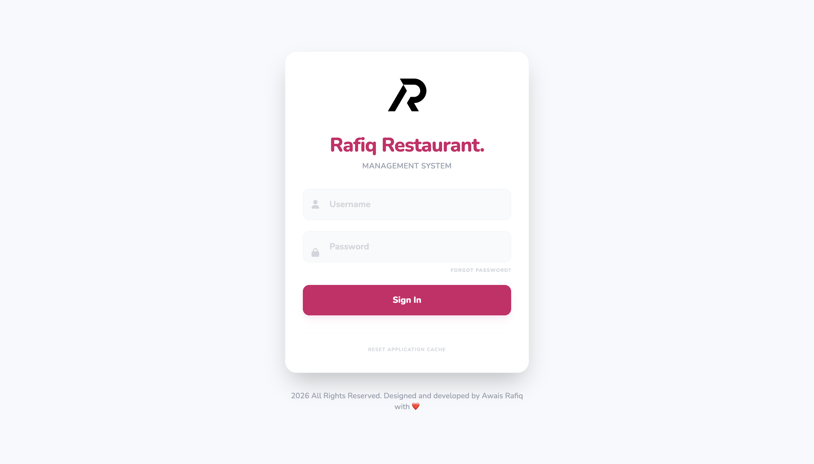
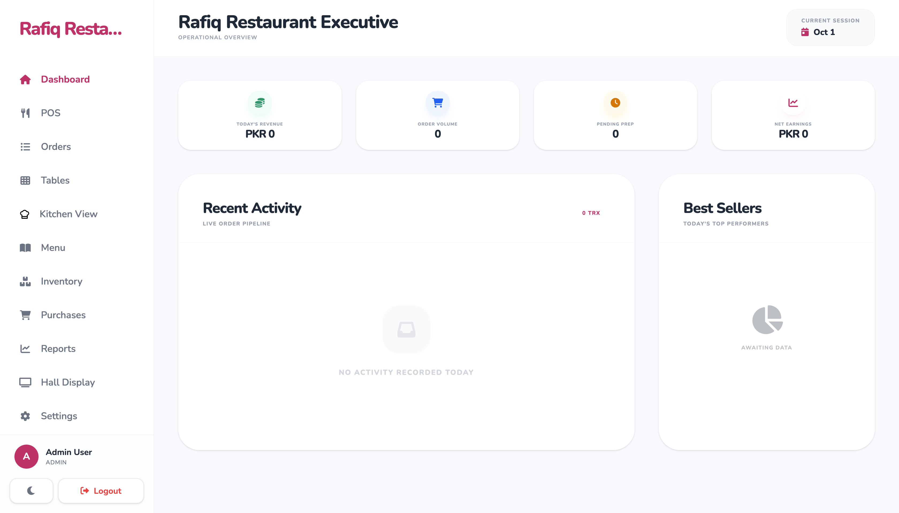
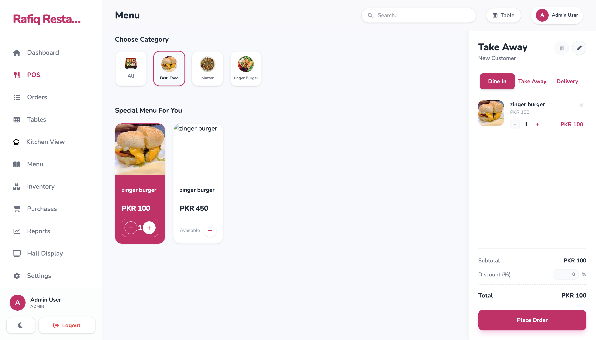
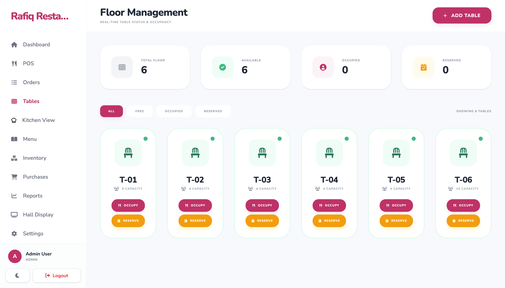
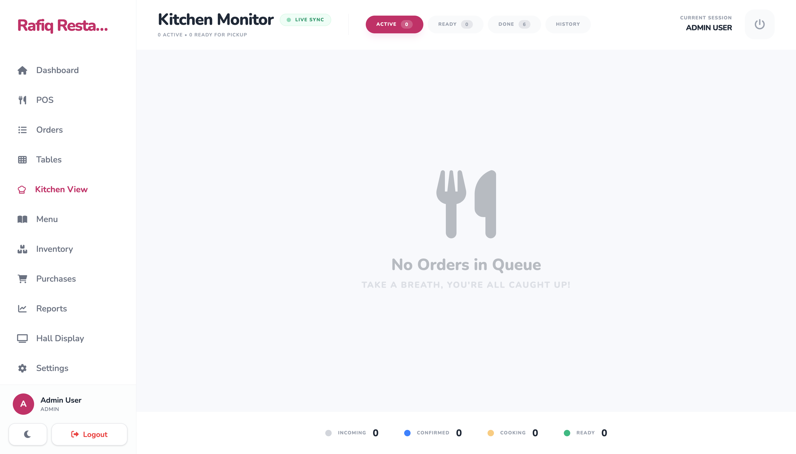
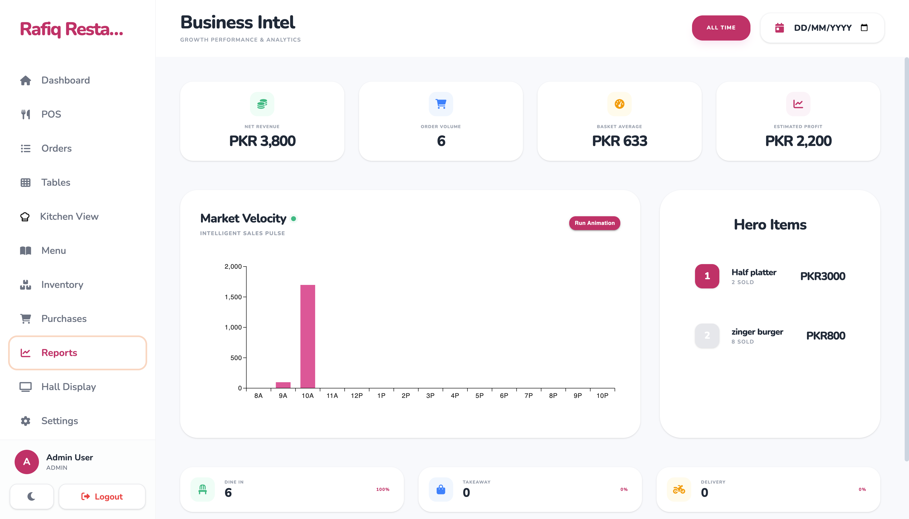
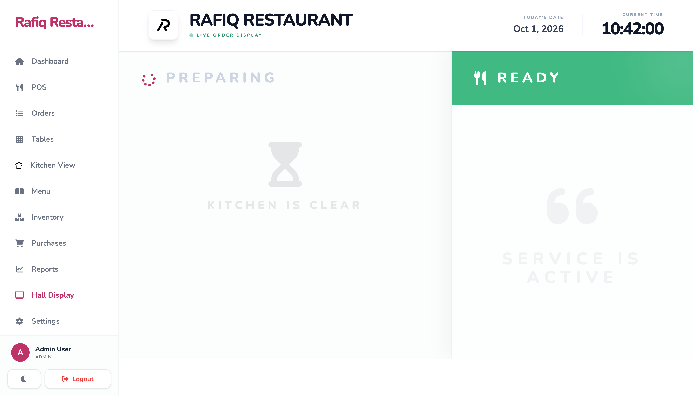
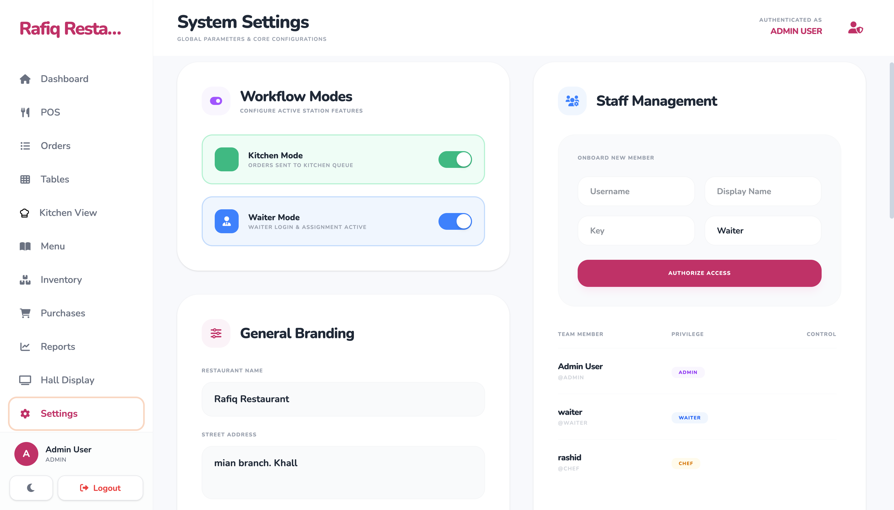

# Hotel POS

A full-stack point-of-sale application for hotels and restaurants. It includes order management, tables, kitchen and waiter views, menu management, inventory, purchases, daily reports, users, and restaurant settings.

## Screenshots

| Login | Executive dashboard |
| --- | --- |
|  |  |

| Point of sale | Table management |
| --- | --- |
|  |  |

| Kitchen monitor | Business reports |
| --- | --- |
|  |  |

| Hall display | System settings |
| --- | --- |
|  |  |

## Technology stack

### Frontend

- TypeScript
- React 19
- Vite 7
- Tailwind CSS 4
- Material UI and MUI Charts
- HTML and CSS

### Backend

- PHP 8.2 or newer
- Laravel 12
- Laravel Sanctum
- MySQL/MariaDB or SQLite

## Requirements

Install these tools before starting:

- Node.js 20 or newer and npm
- PHP 8.2 or newer with the required Laravel extensions
- Composer
- MySQL/MariaDB, or SQLite for a simpler local setup

## Installation

### 1. Clone the repository

```bash
git clone https://github.com/awaisrafiq04/hotel-pos.git
cd hotel-pos
```

### 2. Set up the backend

```bash
cd backend
composer install
cp .env.example .env
php artisan key:generate
```

The default `.env.example` uses MYSQL. Create the database file, then run the migrations and seed the sample data:

```bash
touch database/database.sqlite
php artisan migrate --seed
php artisan storage:link
```

To use MySQL or MariaDB instead, create a database and update these values in `backend/.env` before running the migrations:

```env
DB_CONNECTION=mysql
DB_HOST=127.0.0.1
DB_PORT=3306
DB_DATABASE=hotel_pos
DB_USERNAME=root
DB_PASSWORD=
```

Start the Laravel API:

```bash
php artisan serve
```

The API will be available at `http://127.0.0.1:8000`.

### 3. Set up the frontend

Open another terminal in the project root:

```bash
npm install
cp .env.example .env
npm run dev
```

The frontend will be available at the URL printed by Vite, normally `http://localhost:5173`.

The frontend environment file points requests to:

```env
VITE_API_URL=http://127.0.0.1:8000/api
```

## Demo accounts

Running `php artisan migrate --seed` creates these local accounts:

| Role | Username | Password |
| --- | --- | --- |
| Administrator | `admin` | `admin123` |
| Chef | `chef` | `chef123` |
| Waiter | `waiter` | `waiter123` |

Change these passwords before using the application in production.

## Production build

Build the frontend from the project root:

```bash
npm run build
```

For a production Laravel deployment, set the production database and application values in `backend/.env`, then run:

```bash
cd backend
composer install --no-dev --optimize-autoloader
php artisan migrate --force
php artisan storage:link
php artisan optimize
```

Keep all `.env` files private. They are excluded from Git because they can contain application keys, database passwords, and mail credentials.
